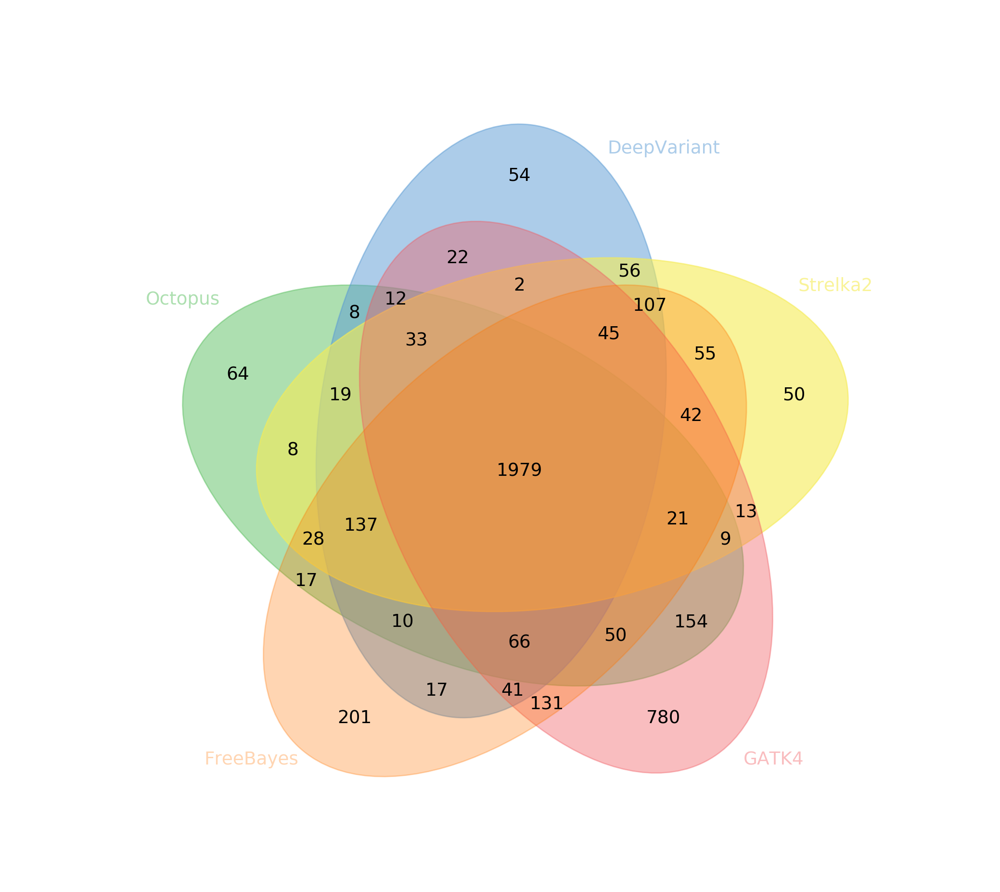

# Starfish

[](http://opensource.org/licenses/MIT)

Starfish is a tool for comparing and intersecting multiple VCF files with haplotype awareness by using the powerful [RTGTools](https://github.com/RealTimeGenomics/rtg-tools) `vcfeval` engine. The name "Starfish" comes from the shape of the Venn diagram the program can draw (with 5 VCFs!).



## Requirements

- Python3
- [pysam](https://github.com/pysam-developers/pysam)
- [bcftools](https://github.com/samtools/bcftools)
- [RTG Tools](https://github.com/RealTimeGenomics/rtg-tools)
- [pyvenn](https://github.com/tctianchi/pyvenn) [optional: for drawing Venn diagrams]

## Installation

```shell
git clone --recursive https://github.com/dancooke/starfish
```

## Usage

There are just three required options:

- `--sdf` (short `-t`): The RTG Tools SDF reference directory (use `rtg format`)
- `--variants` (short `-V`): A list of VCF files to intersect.
- `--output` (short `-O`): A directory path to write intersections.

For example: 

```shell
./starfish \
    -t reference.sdf \
    -V vcf1.vcf.gz vcf2.vcf.gz vcf3.vcf.gz \
    -O isec
```

Will result in the directory `isec` containing the following files:

- `A.vcf.gz`: Records unique to `vcf1.vcf.gz`.
- `B.vcf.gz`: Records unique to `vcf2.vcf.gz`.
- `C.vcf.gz`: Records unique to `vcf3.vcf.gz`.
- `AB.vcf.gz`: Records in `vcf1.vcf.gz` and `vcf2.vcf.gz` but not `vcf3.vcf.gz`.
- `AC.vcf.gz`: Records in `vcf1.vcf.gz` and `vcf3.vcf.gz` but not `vcf2.vcf.gz`.
- `BC.vcf.gz`: Records in `vcf2.vcf.gz` and `vcf3.vcf.gz` but not `vcf1.vcf.gz`.
- `ABC.vcf.gz`: Records common to `vcf1.vcf.gz`, `vcf2.vcf.gz`, and `vcf3.vcf.gz`.

In other words, the VCF files are labelled (in order) using upper-case letters, and the filenames in the output directory contain records unique to the labels in the filename.

### Restricting comparison to certain regions

By default, all regions in the reference genome (which must be the same for all input VCFs) are used. To restrict comparison to a subset of regions, supply a BED file to the `--regions` option.

### Ignoring filtered records

By default, records that are filtered are not included in the comparison. To include them add the `--all-records` option the your command.

### Ignoring genotype mismatches

By default, records will not be matched if the genotypes do not match. To ignore genotype mismatches (and only compare called alleles), use the `--squash-ploidy` option:

```shell
./starfish \
    -t reference.sdf \
    -V vcf1.vcf.gz vcf2.vcf.gz vcf3.vcf.gz \
    -O isec \
    --squash-ploidy
```

### Comparing samples without genotypes

To compare callsets without genotypes; only use `ALT` alleles: 

```shell
./starfish \
    -t reference.sdf \
    -V vcf1.vcf.gz vcf2.vcf.gz vcf3.vcf.gz \
    -O isec \
    --samples ALT \
    --squash-ploidy
```

## Drawing Venn diagrams

Starfish can draw Venn diagrams showing the number of intersected records for up to 6 VCFs (if the `pyvenn` package is installed). To do this you need to supply names for each of the VCFs with the `--names` option and add the `--venn` command:

```shell
./starfish \
    -t reference.sdf \
    -V vcf1.vcf.gz vcf2.vcf.gz vcf3.vcf.gz \
    -O isec \
    --names Octopus GATK4 FreeBayes \
    --venn
```

## Limiations

Starfish has a number of limitations:

- Only haploid and diploid genotype comparisons are supported (due to RTGTools vcfeval).
- Only one sample can be compared. You can use the `--sample` option if your VCFs have multiple samples, but the given sample must be present in all input VCFs.
- The number of unique intersections grows exponentially with the number of input VCFs.
